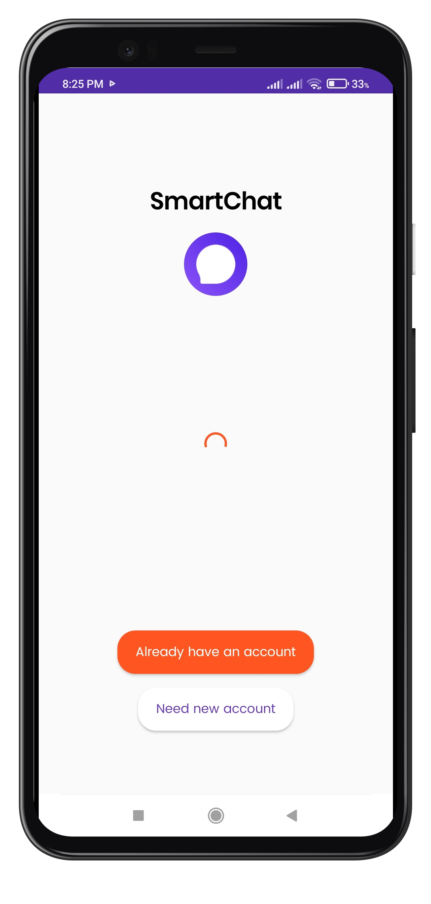
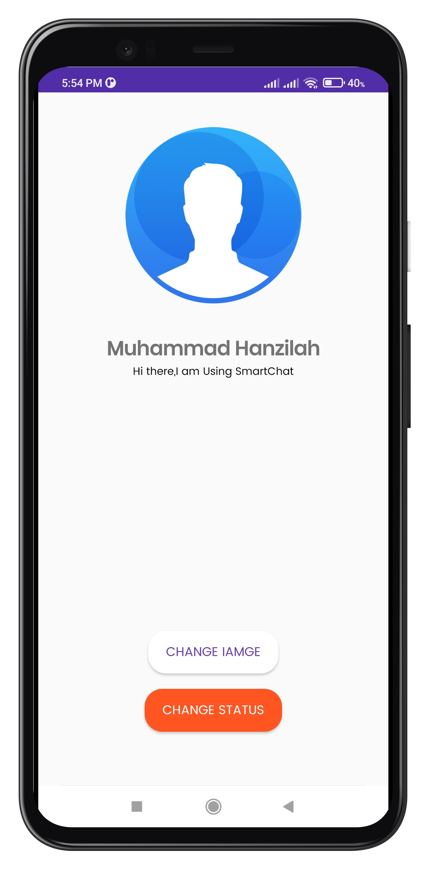

# SmartChat
SmartChat is a real-time one to one chat application built using Firebase Realtime Database.
 
## Note: 
Send Request feature is not fully active yet. If someone sends you a friend request then you may go to thier profile and press the accept request button to start chat with them.

## Features
1. Login/Signup using Email (Firebase Authentication).
2. Offline/Online and Last Seen feature.
3. Send friend request to other users.
4. Chat with friends in real time
5. Send text & Images

## APK
https://drive.google.com/file/d/1sS8s_t_by-_UFP-SnGCphuBvtNOsc9aN/view?usp=sharing

## Screenshots
  
 
  
 

